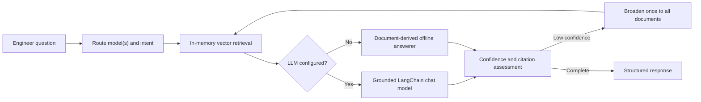

# ME ECU Engineering Assistant

An installable Python package for answering and comparing ECU-700 and ECU-800
specifications with LangChain, LangGraph, in-memory RAG, and MLflow.

It supports OpenAI, Anthropic, and Ollama. The default offline mode uses local hash
embeddings and document-derived answers, so tests run without API credentials.

## Project structure

```text
src/
└── ecu_assistant/
    ├── __init__.py
    ├── config.py
    ├── data/
    │   ├── loaders.py
    │   ├── schemas.py
    │   └── documents/
    ├── retrieval/
    │   ├── chunking.py
    │   ├── embeddings.py
    │   ├── vector_store.py
    │   └── retriever.py
    ├── agent/
    │   ├── graph.py
    │   ├── nodes.py
    │   ├── prompts.py
    │   └── state.py
    ├── evaluation/
    │   ├── golden_set.py
    │   ├── metrics.py
    │   ├── run_eval.py
    │   └── golden_questions.csv
    ├── mlflow_model/
    │   ├── pyfunc_model.py
    │   └── log_model.py
    └── cli.py
tests/
├── test_retrieval.py
├── test_routing.py
├── test_agent_answers.py
└── test_mlflow_predict.py
README.md
pyproject.toml
Makefile
```

Additional `__init__.py` files make the subdirectories explicit Python packages.
Packaged documents and the golden CSV keep the wheel self-contained.

## Architecture



LangGraph flow:

```text
START
  -> route_query
  -> retrieve_context
  -> generate_answer
  -> assess_confidence
      -> broaden_retrieval -> retrieve_context
      -> END
```

Key decisions:

- Deterministic model routing prevents ECU-850/ECU-850b confusion.
- Router decisions expose `models`, `intent`, and `field`.
- Explicit model scope is never expanded to unrelated ECU models.
- Heading-based chunks keep specification tables intact.
- Comparisons preserve evidence from each requested model.
- Generic `lookup_spec` and `compare_specs` operate on any parsed document field.
- LLM and embedding providers are configured independently.
- Low-confidence output retries once, then requests human review.
- The offline answerer derives facts from the documents.

## Installation

Python 3.10–3.12:

```bash
python -m venv .venv
source .venv/bin/activate             # Windows: .venv\Scripts\Activate.ps1
python -m pip install -e ".[dev]"
```

Provider extras:

```bash
python -m pip install -e ".[openai,mlflow]"
python -m pip install -e ".[anthropic,mlflow]"
python -m pip install -e ".[ollama,mlflow]"
```

Common commands:

```bash
make test
make lint
make evaluate
make build
make log-model
```

## Configuration

Copy `.env.example` or export:

| Variable | Values/default |
| --- | --- |
| `ME_ECU_LLM_PROVIDER` | `none`, `openai`, `anthropic`, `ollama`; default `none` |
| `ME_ECU_LLM_MODEL` | Provider model name |
| `ME_ECU_LLM_BASE_URL` | Optional compatible API/Ollama URL |
| `ME_ECU_EMBEDDING_PROVIDER` | `hash`, `openai`, `ollama`; default `hash` |
| `ME_ECU_EMBEDDING_MODEL` | Embedding model name |
| `ME_ECU_EMBEDDING_BASE_URL` | Optional embedding URL |
| `ME_ECU_RETRIEVAL_K` | Retrieved chunks; default `4` |
| `ME_ECU_LOW_CONFIDENCE_THRESHOLD` | Review threshold; default `0.55` |

Provider integrations read standard credentials such as `OPENAI_API_KEY` and
`ANTHROPIC_API_KEY`.

Ollama example:

```bash
ollama pull llama3.2
ollama pull nomic-embed-text
export ME_ECU_LLM_PROVIDER=ollama
export ME_ECU_LLM_MODEL=llama3.2
export ME_ECU_EMBEDDING_PROVIDER=ollama
export ME_ECU_EMBEDDING_MODEL=nomic-embed-text
```

OpenAI example:

```bash
export OPENAI_API_KEY="..."
export ME_ECU_LLM_PROVIDER=openai
export ME_ECU_LLM_MODEL=gpt-4o-mini
export ME_ECU_EMBEDDING_PROVIDER=openai
export ME_ECU_EMBEDDING_MODEL=text-embedding-3-small
```

Anthropic has no embedding API, so pair it with Ollama or hash embeddings.

## Usage

```bash
ecu-agent "Compare the CAN bus capabilities of ECU-750 and ECU-850."
```

```python
from ecu_assistant import ECUEngineeringAgent

agent = ECUEngineeringAgent()
result = agent.invoke("What are the AI capabilities of the ECU-850b?")
print(result)
```

Response:

```json
{
  "answer": "The ECU-850 has 2 GB LPDDR4 RAM. [Source: ECU-800_Series_Base.md]",
  "confidence": 0.99,
  "citations": ["ECU-800_Series_Base.md"],
  "routed_models": ["ECU-850"],
  "intent": "specification",
  "field": "memory",
  "needs_human_review": false
}
```

Routing examples:

```python
from ecu_assistant.agent.nodes import QueryRouter

router = QueryRouter()

router.route("850 storage")
# RouteDecision(
#   models=["ECU-850"],
#   intent="specification",
#   field="storage",
#   ...
# )

router.route("ECU 850 b CAN speed")
# RouteDecision(
#   models=["ECU-850b"],
#   intent="specification",
#   field="can",
#   ...
# )
```

Low-confidence retries broaden chunk retrieval only within the routed models.
For example, an unsupported ECU-750 question remains scoped to ECU-750 and never
retrieves ECU-850 or ECU-850b documents.

### Generic specification API

Table fields are resolved dynamically, with aliases such as CPU → processor,
flash → storage, CAN bus → CAN, and remote updates → OTA:

```python
from ecu_assistant.data import DocumentRepository

repository = DocumentRepository()

repository.lookup_spec("ECU-750", "CPU")
# "32-bit Cortex-M4 @ 120 MHz"

repository.lookup_spec("ECU-850", "network interface")
# "1x 100BASE-T1"

repository.compare_specs(
    ["ECU-750", "ECU-850", "ECU-850b"],
    "storage capacity",
)
# {
#   "ECU-750": "2 MB Internal Flash",
#   "ECU-850": "16 GB eMMC",
#   "ECU-850b": "32 GB eMMC",
# }
```

New table fields require no answer-handler changes: the loader adds them to
`ModelRecord.specs`, field detection discovers the key, and the generic lookup or
comparison formatter returns the values with sources.

## Evaluation

```bash
pytest
evaluate-local
```

The evaluator writes `evaluation-results.json` with pass rate, expected-fact
recall, mean/p95 latency, confidence, review decisions, and generated answers.

Release gates:

- at least 8/10 golden questions pass;
- p95 latency below 10 seconds;
- pylint above 8.5/10;
- unsupported questions are not returned with high confidence.

Domain experts should review positive/negative facts, inherited features,
ambiguous models, comparisons, and exact commands. New document revisions should
add regression questions.

## MLflow

```bash
export MLFLOW_TRACKING_URI="sqlite:///mlflow.db"
export ME_ECU_MLFLOW_EXPERIMENT="ecu-assistant"
log-model
mlflow ui --backend-store-uri sqlite:///mlflow.db --port 5000
```

Windows PowerShell:

```powershell
$env:MLFLOW_TRACKING_URI = "sqlite:///mlflow.db"
$env:ME_ECU_MLFLOW_EXPERIMENT = "ecu-assistant"
log-model
```

The run records model signature, packaged documents, serving dependencies,
provider/retrieval metadata, package version, and optional model registration via
`ME_ECU_REGISTERED_MODEL_NAME`.

```python
import mlflow
import pandas as pd

model = mlflow.pyfunc.load_model("<model-uri printed by log-model>")
result = model.predict(
    pd.DataFrame({"query": ["How much RAM does the ECU-850 have?"]})
)
```

Log golden-set metrics with:

```bash
evaluate-mlflow
```

## Validation and monitoring strategy

Automated tests cover loading, normalization, chunk metadata, routing, comparison
retrieval, all ten challenge answers, low-confidence review, and MLflow input
shapes. Production monitoring should track latency, provider failures, retrieved
models, document versions, fallback rate, confidence, review rate, citation
coverage, and sampled expert feedback.

## Error handling

- Missing documents fail with the exact path.
- Empty questions return a controlled review-required response.
- Invalid MLflow inputs raise a clear contract error.
- Unsupported providers and missing extras produce actionable messages.
- Missing evidence is flagged for review rather than fabricated.

## Scalability and limitations

For a larger corpus, move chunks to a persistent vector database with revisions
and ACL metadata, embed only changed chunks, use structured routing, cache by
document version, and evaluate candidate indexes before promotion.

Hash embeddings are a reproducibility fallback rather than production semantic
search. Confidence is a heuristic that should be calibrated with expert labels.
The sample corpus has no conflicting revisions or validity periods.
